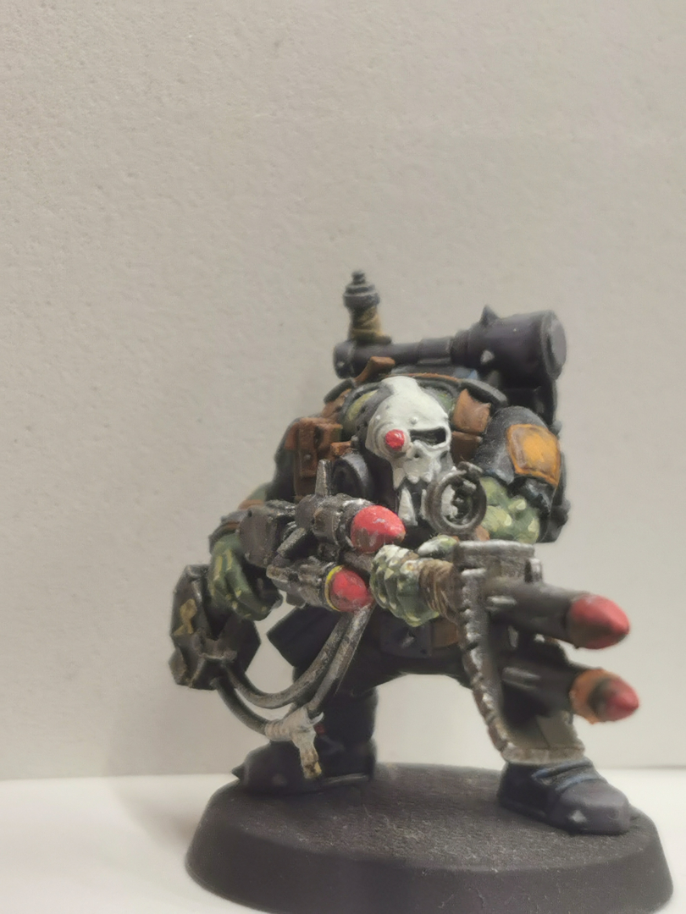
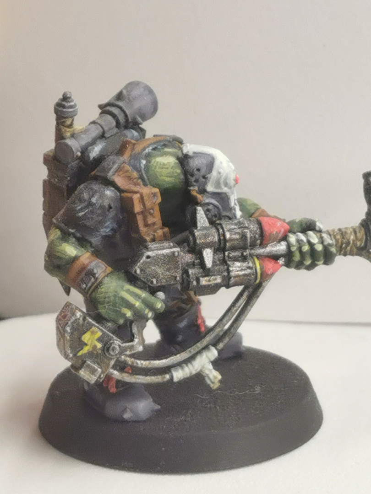
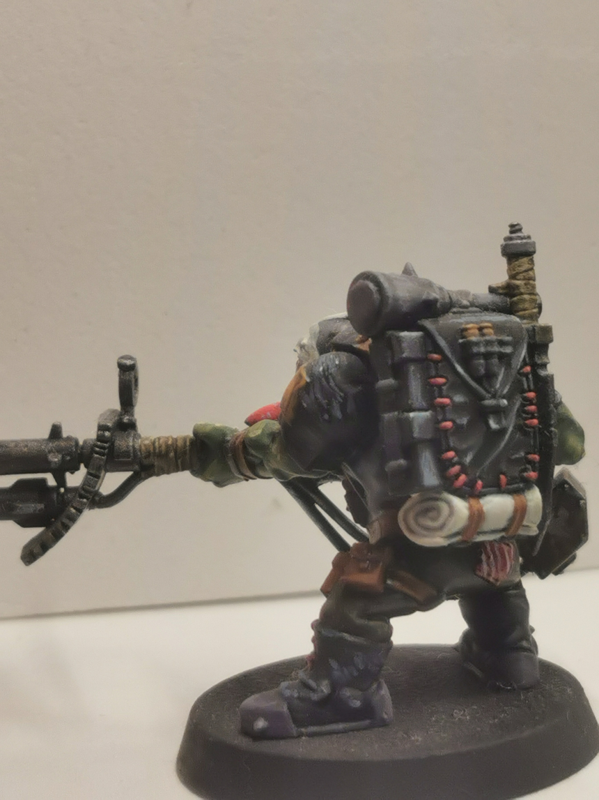

{% include carousel.html height="50" unit="%" duration="7" number="1" %}

# Blender

# Halloween Projects
## The Coffin
[Github Page](https://github.com/AMarinic92/SAME51-Kit/tree/halloween)    
A small animatronic project I built for Halloween 2024 using the SAME51 development board, pneumatic relays, and a piston. I designed a randomly timed and dynamically programmed coffin mechanism, creating an unpredictable and eerie effect.

# Warhammer 40K
carousels:
  - images: 
    - image: ./assets/images/rlfront.jpg
    - image: ./assets/images/rlside.jpg
    - image: ./assets/images/rlback.jpg

[back](./)
